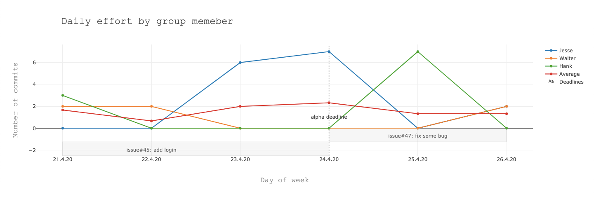

## Aufgabenstellung 

### Szenario
*Sie möchten ein studentisches Github-Repository in Bezug auf den geleisteten täglichen Arbeitsaufwand pro TeilnehmerIn eines Projektteams untersuchen. Auf diese Art und Weise möchten Sie besonders starke Divergenzen in der geleisteten Arbeit erkennen und vermeintliche Probleme mit den Studierenden zeitnah klären können. Zur besseren Übersicht möchten Sie zudem noch eine Darstellung gegen die an den entsprechenden Tagen aktiv bearbeiteten Arbeitspakete, sowie die entsprechenden Deadlines des Kurses anzeigen.*

### Aufgabe

Implementieren Sie bitte beispielhaft die weiter unten beschriebene Analyse (z.B. in Pseudocode, oder in einer von Ihnen favorisierten Programmiersprache). Falls es Fragen oder Unklarheiten gibt, können Sie sich gerne über Voicechat bei mir melden. Geben Sie mir außerdem über Voicechat Bescheid, wenn Sie bereit sind, die Studie zu beginnen - ich gebe Ihnen dann Zugang zum Code-Editor der Studie.

**Es geht in der Studie darum einen Einblick zu erhalten, wie Sie bei der Erstellung eines solchen Moduls intuitiv vorgehen würden. Sie müssen weder lauffähigen Code produzieren, noch innerhalb der gegebenen Zeit alle Features umsetzen.**

### Plugin-Spezifikationen

An das Plugin sind folgende Anforderungen zu stellen:

- Visualisierung des täglichen Aufwands (y-Achse) nach StudentIn über Zeit (x-Achse) in einem Graphen
  - Eine Linie für den täglichen Arbeitsaufwand pro StudentIn
  - Eine weitere Linie mit dem durchschnittlichen täglichen Arbeitsaufwand für alle StudentInnen des Teams
  
- Der Aufwand wird, je nach Einstellung, an der Zahl der Commits, oder geänderter Zeilen bemessen

- Im Repository gesetzte Milestones, sowie von Dozierenden gesetzte Deadlines sollen als vertikale, benannte Balken gerendert werden

- In einem horizontalen Liniendiagramm sollen die zu der Zeit bearbeiteten Arbeitspakete (als Issues modelliert) angezeigt werden (Balken zwischen Start- und Enddatum, benannt mit Titel des Issues).  

Im Folgenden ist eine beispielhafte Darstellung der Visualisierung abgebildet:

  

